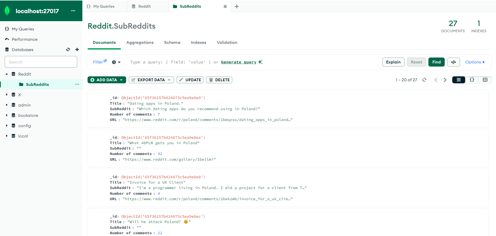
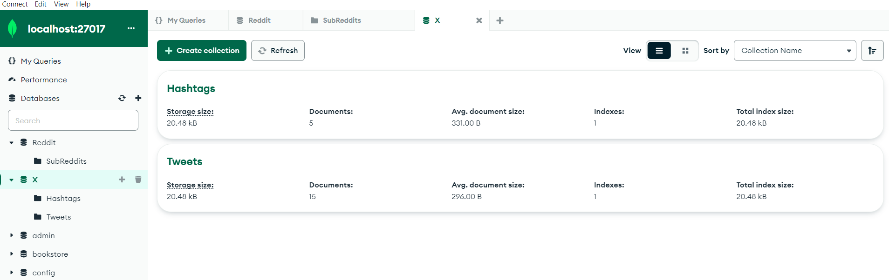
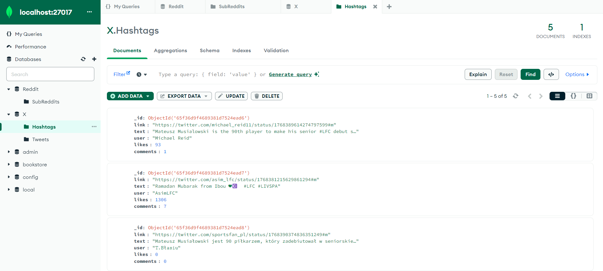
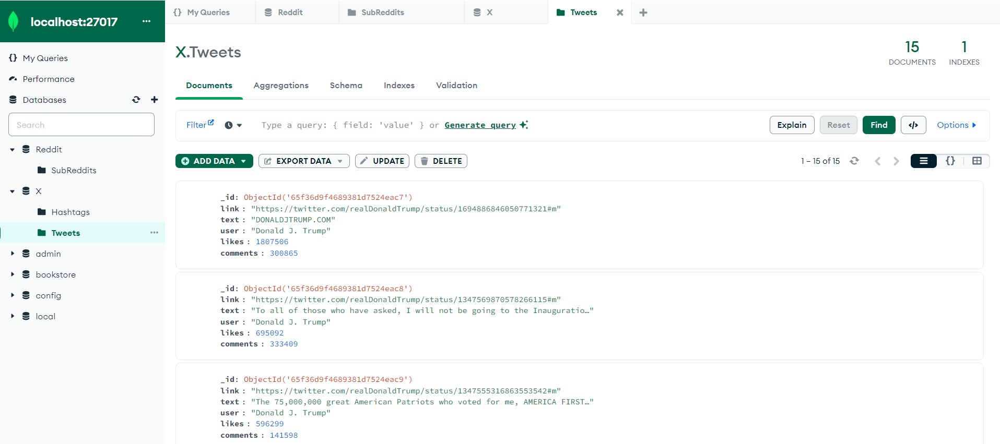

# Reddit_X_Scrapper

## Spis treści
* [Informacje ogólne](#informacje-ogólne)
* [Użyte technologie](#użyte-technologie)
* [Zrealizowane funkcjonalności](#zrealizowane-funkcjonalności)
* [Konfiguracja](#konfiguracja)
* [Ograniczenia](#ograniczenia)
* [Zrzuty ekranu](#zrzuty-ekranu-bazy)

## Informacje Ogólne

Repozytorium zawiera dwie aplikacje służące do scrapowania danych z platform Reddit oraz  X (Twitter). 

## Użyte technologie

Obie aplikacje zostały napisane w technologii Python za pomocą notatnika Jupyter Notebook. Dane kluczy konta użytkownika do API Reddita oraz Twittera zostały zapisane w plikach json. Dane zostały zapisane w bazie NoSQL MongoDB.

## Zrealizowane funkcjonalności 

Notatnik Reddit.ipynb zbiera subreddity na podstawie wprowadzonej nazwy reddita. W zebranych informacjach znajdują się:
- Tytuł subreddita
- Treść
- Liczba komentarzy
- Adres URL

Notatnik Twitter.ipynb zbiera najnowsze tweety od ustalonego wcześniej użytkownika oraz tweety z również wcześniej ustalonego hashtagu. Zebrane dane posiadają:

- Adres URL do tweeta
- Treść tweeta
- Nazwę użytkownika
- Ilość like'ów
- Liczba komentarzy

## Konfiguracja

Jeżeli aplikacje mają zostać odpalone lokalnie, na samym początku tworzymy nowe środowisko wirtualne, w ktorym instalujemy biblioteki za pomoocą pliku requirements.txt zawartego w repozytorium. W folderze roboczym wypakowywujemy wszystkie pliki z repozutorium. Jeżeli będziemy korzystać z np. Visual Studio Code wybieramy jako kernel nasze wirtualne środowisko. Aby dane zostały zapisane potrzebne będzie zainstalowane MongoDB. Po podłączeniu się do bazy, w skrypcie wybieramy adres URI bazy.

## Ograniczenia

Niestety ze względów braku dostępu do darmowego Google CLoud oraz AWS nie udostępniłem skryptu na obsługę chmurową. Jeżeli miałbym do takowej opcji dostęp, cały skrypt zostałby sprowadzony do jednej funckji, w której argumentami byłyby np. słowa kluczowe takie jak nazwa redditu lub nazwa użytkownika. Taka funkcja mogłaby być uruchamiana np. raz dziennie.

Ze względu na bezpieczeństwo, nie powinienem udostępnić swoich wartośći kluczy do API platformy X. 
W pliku twitter_config.json zamieniamy hashtagi na poprawne dane z API Twittera z konta developerskiego.

## Zrzuty ekranu bazy

